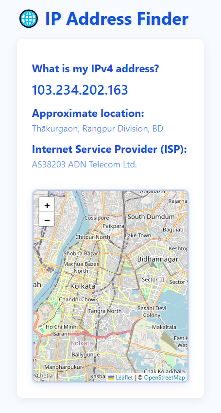

# IP Finder React App



## 🧭 Overview

**IP Finder React App** is a simple and modern tool to find your IP address and related information.  
Built with **React**, it displays your IP, location, ISP, and more in a clean, responsive interface.

---

## 🛠️ Tech Stack


---

## 🚀 Features

✅ Real-time IP address lookup  
✅ Shows location, ISP, country, and more  
✅ Fully responsive design  
✅ Clean and simple UI  
✅ Fast loading

---

## 📂 Folder Structure

```plaintext
ip-finder-app/
  ├── public/
  │     └── index.html
  ├── src/
  │     ├── components/
  │    
  │     
  └── README.md
```

---

## 🚀 Getting Started

1. **Clone the repository:**
   ```bash
   git clone https://github.com/your-username/ip-finder-app.git
   cd ip-finder-app
   ```

2. **Install dependencies:**
   ```bash
   npm install
   ```

3. **Run the app:**
   ```bash
   npm start
   ```

---

## 📞 Contact

Author: Shirajam Munir  
Email: [mdmunir6630@gmail.com]  
GitHub: [https://github.com/muniralways/]  
Portfolio: [your-portfolio-link]